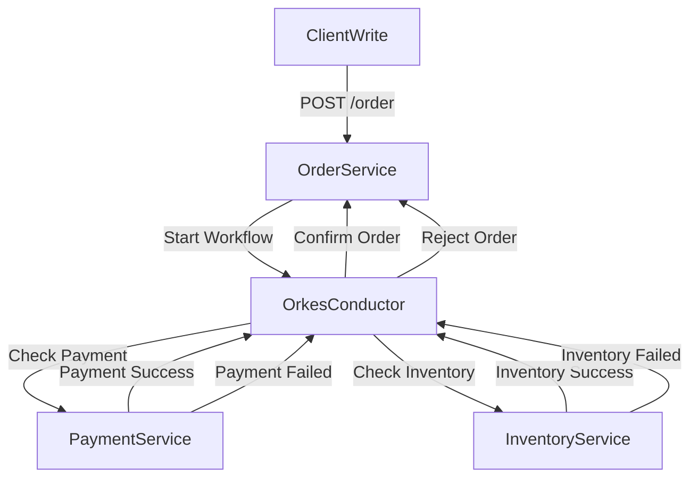
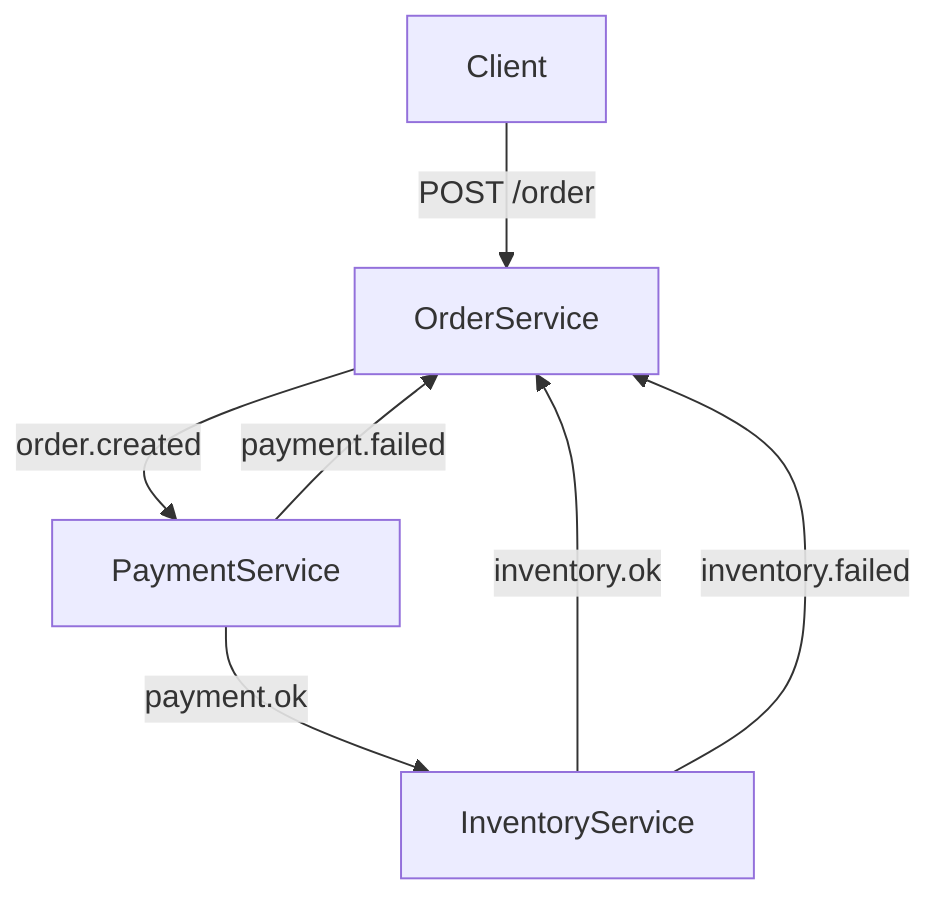
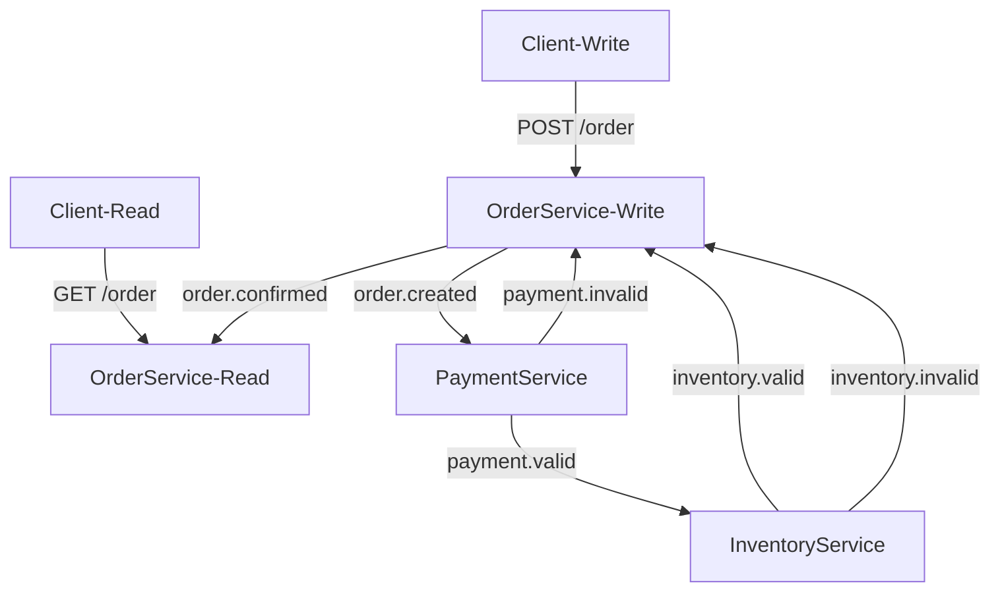

# Data Management
## Lab 1: Orchestration-based Saga

In this exercise, three services collaborate to implement a **Saga Pattern** using Orkes Conductor. The services are:

1. **Order Service**: Accepts a POST request to create an order (`POST /order`), and starts the workflow.
2. **Payment Service**: Validates and processes the customer’s payment.
3. **Inventory Service**: Checks product availability and reserves the items in the warehouse.



## Lab 2: Choreography-based Saga

In this exercise, three services collaborate to implement a **Saga Pattern** using asynchronous messaging. The services are:

1. **Order Service**: Accepts a POST request to create an order (`POST /order`), and starts the workflow.
2. **Payment Service**: Validates and processes the customer’s payment.
3. **Inventory Service**: Checks product availability and reserves the items in the warehouse.


## Lab 3: CQRS


### Introduction

In this exercise, three services collaborate to implement a **Saga Pattern** using asynchronous messaging.\
The services are:
- **Order service**: Accepts a POST request and create an order, starting the workflow.
- **Read Order service**: Accepts a GET request to read completed orders.
- **Payment service**: Validates the customer's payment.
- **Inventory service**: Checks products availability and reserve the items for the order.

The communication occurs via **RabbitMQ**, defining a queue for each service.\
Every service has its own database.

### Commands

```bash
curl -X POST http://172.20.8.11:9000/order  -H "Content-Type: application/json"  -d '{"customerId": "user", "productIds": ["PROD-A1", "PROD-D4"], "creditCardNumber": "7777-1234-5678-0000"}'
```


```bash
curl -X GET "http://172.20.8.14:9003/order?customerId=user&year=2025&month=8" -H "Accept: application/json"
```

```bash
docker exec -it mysql_cqrs mysql -uroot -padmin
```