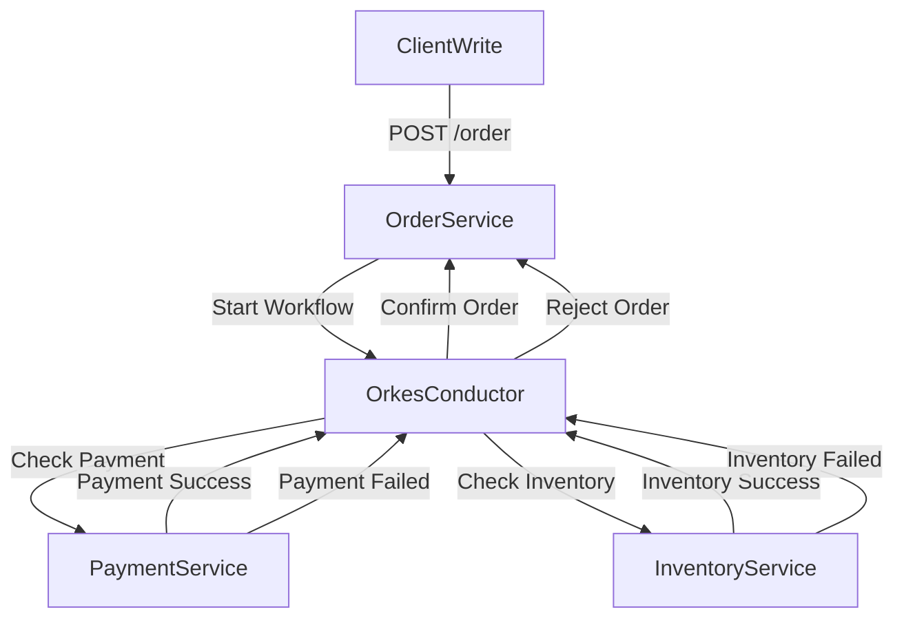
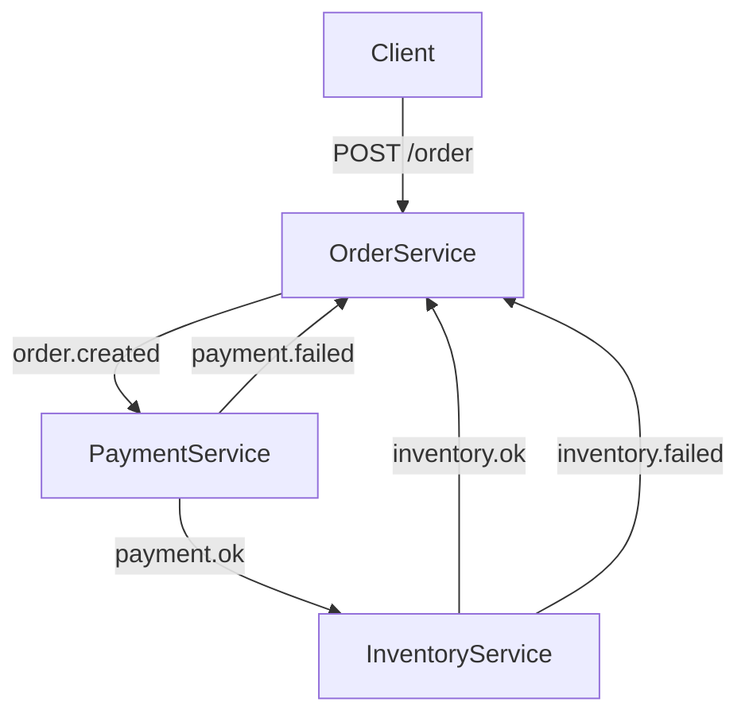

# Data Management
## Lab 1: Orchestration-based Saga

In this exercise, three services collaborate to implement a **Saga Pattern** using Orkes Conductor. The services are:

1. **Order Service**: Accepts a POST request to create an order (`POST /order`), and starts the workflow.
2. **Payment Service**: Validates and processes the customer’s payment.
3. **Inventory Service**: Checks product availability and reserves the items in the warehouse.

## Lab 2: Choreography-based Saga

In this exercise, three services collaborate to implement a **Saga Pattern** using asynchronous messaging. The services are:

1. **Order Service**: Accepts a POST request to create an order (`POST /order`), and starts the workflow.
2. **Payment Service**: Validates and processes the customer’s payment.
3. **Inventory Service**: Checks product availability and reserves the items in the warehouse.

