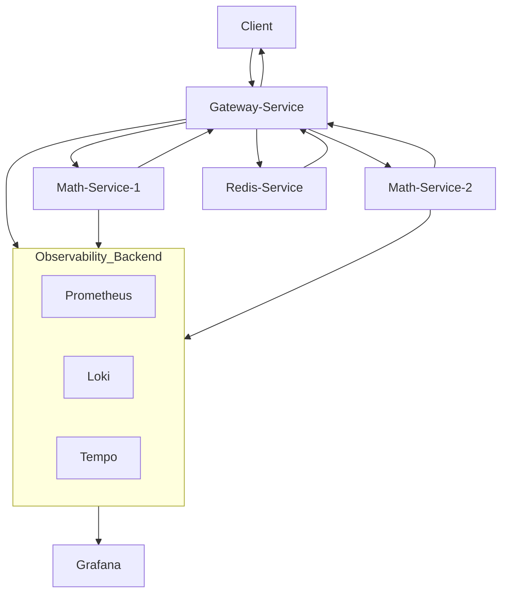

# Observability
## Math-otlp



### Introduction

This project implements an observable microservices system, using different tools for monitoring, logging and tracing.\
The application is composed by 2 main services:
- **Math service**: Exposes an API to compute the prime divisors of a given number.
- **Gateway service**: Acts as an API gateway, routing requests to multiple instances of math service. It also integrates a caching layer to improve the performances: **Redis**. Furthermore, there is a resiliency system, which retries requests up to 3 times, giving a fallback output in case of repeated failures.

For the observability part, these tools have been implemented:
- **Prometheus** for metrics collection.
- **Grafana**: for the visualization through interactive dashboards.
- **Loki**: for centralized log aggregation.
- **Tempo**: for distributed tracing via OpenTelemetry.

### Commands

- **Grafana**: http://localhost:3000 (default login: admin/admin)

```bash
curl -X GET "http://172.20.7.12:8080/divisors?n=20&times=100&faults=50"
```

Calculates the prime divisors of 20, 100 times with 50% of error.