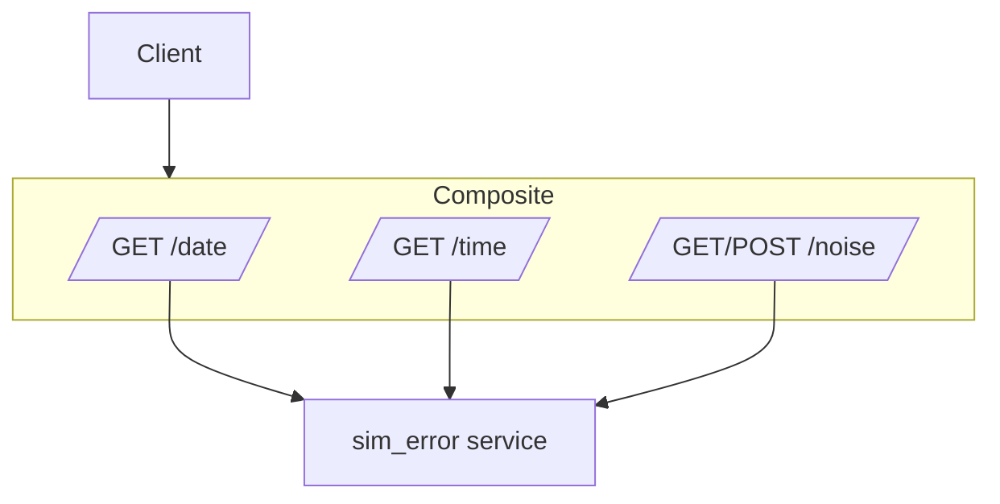

# Resiliency
## Datetime resiliency



### Introduction

This exercise implements a resilience mechanisms to enhance system reliability.
The services are:
- **Sim_error service**: Provides current date and current time. It also exposes an API that allow to modify noise settings (delay and faults percentage), in order to simulate connection errors.
- **Datetime composite service**: Exposes an API to get date or time from sim_error service. It also integrates a resiliency system, which retries requests up to 3 times for time and 4 times for date, giving a fallback output in case of repeated failures.
It also has a timeout of 10s, which, if reached, give a fallback output too.

### Commands

```
curl -X GET "http://172.20.6.11:8000/time"
curl -X GET "http://172.20.6.11:8000/date"
```

```
curl -X POST http://172.20.6.10:8000/noise -H "Content-Type: application/json" -d '{"delay": 0, "fault": 50}'
curl -X GET "http://172.20.6.10:8000/noise"
```

Fault indicates the fault percentage ("faults": 50 means 50% of failure of the request)